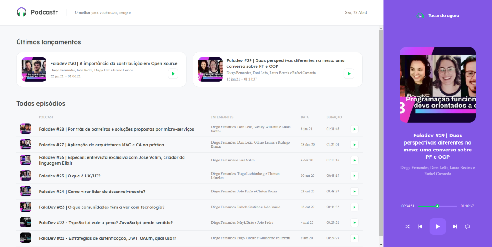

<h1 align="center">
  
</h1>

<p align="center">
  <a href="#-projeto">Projeto</a>&nbsp; • &nbsp;
  <a href="#-tecnologias">Tecnologias</a>&nbsp; • &nbsp;
  <a href="#-como-executar-o-projeto">Como executar</a>&nbsp; • &nbsp;
  <a href="#-autor">Autor</a>&nbsp; • &nbsp;
  <a href="#memo-licença">Licença</a>
</p>

<p align="center">
  
</p>

<br>

<p align="center">
  
</p>

## 💻 Projeto

O Podcastr é uma aplicação para reprodução de podcast, onde é possível selecionar o episódio a ser reproduzido, controlar o play, pause, episódio anterior, próximo episódio, modo aleatório e modo repetir, é possível também selecionar um episódio específico e será apresentado uma breve descrição sobre o tema.

---

## 🛠 Tecnologias

Esse projeto foi desenvolvido com as seguintes tecnologias:

- [React.js](https://pt-br.reactjs.org/)
- [Next.js](https://nextjs.org/)
- [TypeScript](https://www.typescriptlang.org/)
- [Sass](https://sass-lang.com/)
- [Node.js](https://nodejs.org/en/)

---

## 🚀 Como executar o projeto

### Pré-requisitos

Antes de começar, você vai precisar ter instalado em sua máquina as seguintes ferramentas:
[Git](https://git-scm.com), [Node.js](https://nodejs.org/en/).
Além disto é bom ter um editor para trabalhar com o código como [VSCode](https://code.visualstudio.com/)

### Rodando a aplicação

```bash
# Clone este repositório
$ git clone https://github.com/coutinho04/podcastr.git

# Acesse a pasta do projeto no terminal/cmd
$ cd podcastr

# Instale as dependências
$ npm install

# Execute o servidor
$ npm run server

# O servidor iniciará na porta:3333 - acesse <http://localhost:3333/episodes>

# Execute a aplicação em modo de desenvolvimento
$ npm run dev

# A aplicação iniciará na porta:3000 - acesse <http://localhost:3000/>

```

---

### 👨‍💻 Autor

 
 <br />
 <sub><b>Felipe Coutinho</b></sub></a>

[](https://www.linkedin.com/in/felipecoutinho04/)
[](mailto:felipe04coutinho@gmail.com)

---

## 📝 Licença

Este projeto esta sobe a licença [MIT](./LICENSE).

Feito com ❤️ por Felipe Coutinho 👋🏽 [Entre em contato!](https://www.linkedin.com/in/felipecoutinho04/)

---
